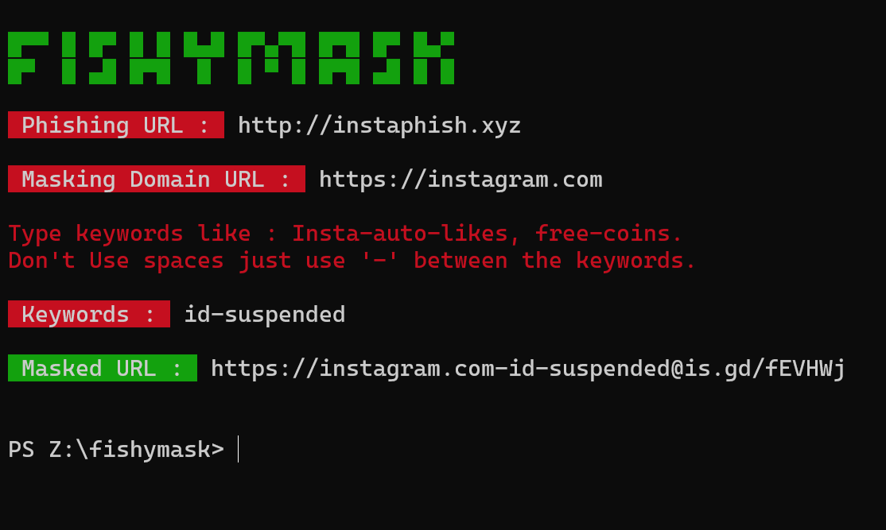

# FISHYMASK
Fishymask is a Python Script to hide phishing URL under a Legit URL.

**Disclaimer**\
This script is created for **Educational purposes only**.\
Use Responsibly! Don't use it for illegal phishing activity or illegal things.\
The Developer of the Script is not responsible for it.

**Note** : This Script is inspired from https://github.com/jaykali/maskphish\
but rather than bash script, it is made using python.

## Usage
Tested on Windows, Ubuntu, Termux.\
Clone this repo , go to the Fishymask folder & run the python script.

```bash
 git clone https://github.com/iamjinx/fishymask.git
 
 cd fishymask
 
 python fishymask.py
```


## License
©iamjinx - 2022 Ltd.\
Telegram Id : @iamjinnx
